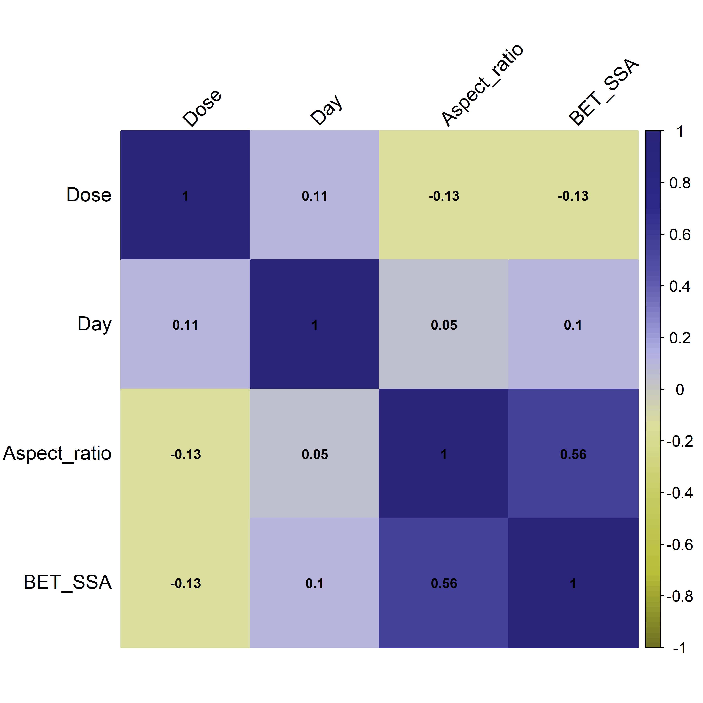
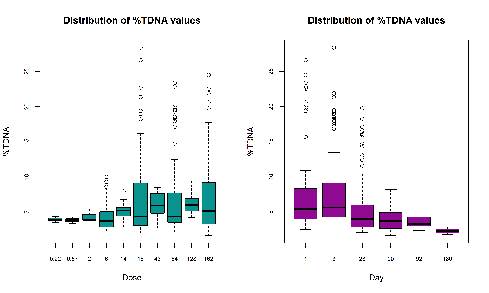

```{r setup, include=FALSE}
knitr::opts_chunk$set(echo = TRUE, 
                      message = FALSE, 
                      cache = FALSE,
                      warning = FALSE,
                      fig.align = 'center',
                      dpi = 300)
```


```{r packages, echo=FALSE}

packages <- function(x){
  not_installed <- x[!x %in% installed.packages()[, "Package"]]
  if(length(not_installed) > 0) 
    install.packages(not_installed, dependencies = TRUE)
  invisible(lapply(x, require, character.only = TRUE))
}

packages(c("magrittr", "dplyr", "tidyverse", "GGally", "ggpubr", "corrplot"))
```


```{r data import}
setwd(dirname(rstudioapi::getActiveDocumentContext()$path))
data <- read.csv2("input_file.csv", header = TRUE, dec = ",")
```


```{r splitting, autoscaling}
# Data sorting
SortedData <- data[order(data[, ncol(data)]), ]

# The most extreme values should be included in the training set. The number of rows with the lowest and highest values to be included in the training set: 
nexv = 3

ExRows <- rbind(SortedData[1:nexv, ], SortedData[(nrow(SortedData)-nexv+1):nrow(SortedData), ])

DataSplit <- SortedData[-c(1:nexv, (nrow(SortedData)-nexv+1):nrow(SortedData)), ]

# Training and Validation Sets - 
ValidationSet <- data.frame()  
TrainingSet <- data.frame()       

for (i in seq_len(nrow(DataSplit))) {
  # The data split ratio is 2:1, where every third element is placed in the validation set.
  if (i %% 3 == 1) {
    ValidationSet <- rbind(ValidationSet, DataSplit[i, ])
  } else {
    TrainingSet <- rbind(TrainingSet, DataSplit[i, ])
  }
}

TrainingSet <- rbind(ExRows, TrainingSet)

TrainingSet$Set <- 'T'
ValidationSet$Set <- 'V'

# Responces vectors
RespTrain <- as.vector(TrainingSet[, ncol(TrainingSet) - 1])
RespVal <- as.vector(ValidationSet[, ncol(ValidationSet) - 1])

# Matrix with descriptors
DescT <- as.matrix(TrainingSet[, 2:(ncol(TrainingSet) - 2)])
DescV <- as.matrix(ValidationSet[, 2:(ncol(ValidationSet) - 2)])

# Name of columns
ChemNameT <- TrainingSet[,1]
ChemNameV <- ValidationSet[,1]

# Autoscaling data
scaling <- function(x, sc_data){
  average <- mean(sc_data)
  stdev <- sd(sc_data)
  if (stdev == 0) {
    return(rep(0, length(x)))  
  }
  autoscaled_x <- (x-average)/stdev
  autoscaled_x
}

AutoscDescT <- as.data.frame(matrix(NA, nrow = nrow(DescT), ncol = ncol(DescT)))
AutoscDescV <- as.data.frame(matrix(NA, nrow = nrow(DescV), ncol = ncol(DescV)))


for (i in 1:ncol(DescT)) {
  AutoscDescT[, i] <- scaling(DescT[, i], DescT[, i])
}

for (i in 1:ncol(DescV)) {
  AutoscDescV[, i] <- scaling(DescV[, i], DescT[, i])
}

DescNames <- colnames(DescT)
AutoscDescNames <- paste0("Autoscaled_", DescNames) 

# Summary table
Summary <- data.frame(rbind(
  setNames(cbind(ChemNameT, DescT, AutoscDescT, RespTrain, TrainingSet$Set), 
           c("ChemName", DescNames, AutoscDescNames, "Experimental", "Set")), 
  setNames(cbind(ChemNameV, DescV, AutoscDescV, RespVal, ValidationSet$Set), 
           c("ChemName", DescNames, AutoscDescNames, "Experimental", "Set"))))

rownames(Summary) <- NULL

print(Summary)

```

```{r heatmap for independent variables, fig.width=6, fig.height=6, fig.path='figures/'}
# The heatmap plot displays the correlation levels between the independent variables. Correlation coefficients are determined using Pearson's test.

png("figures/HeatMap.png", width = 6, height = 6, units = "in", res = 600)

CorrelationMatrix <- cor(data[, 2:(ncol(data) - 1)], use = "complete.obs")

col <- colorRampPalette(c("#6e7222","#b8bf3a", "#c6cb61", "#dbdf9c", "#b3b0e5", "#5c57ac", "#2e2988", "#292479"))

corrplot(CorrelationMatrix, 
          method = "color", 
          col = col(100), 
          tl.col = "black", 
          tl.srt = 45, 
          addCoef.col = "black", 
          number.cex=0.7)

invisible(dev.off())

```



```{r boxplot for dependent variables, fig.width=10, fig.height=6}
#The distribution of the dependent variable is shown across different doses and exposure durations to the nanomaterial. The boxplot highlights the toxicity values, with the median indicated by the thick line within the box. The box boundaries represent the first and third quartiles of the data, while the "whiskers" extend to 1.5 times the interquartile range (IQR) beyond the quartiles. Points beyond this range are identified as outliers.

png("figures/Boxplot.png", width = 10, height = 6, units = "in", res = 600)

par(mfrow = c(1,2))

boxplot(TDNA~ Dose, 
        data = data,
        col = "#09938F", 
        xlab = "Dose", 
        ylab = "%TDNA", 
        main = "Distribution of %TDNA values",
        cex.axis = 0.7, 
        cex.lab = 1,    
        cex.main = 1.2)
boxplot(TDNA~ Day, 
        data = data,
        col = "#8f0993", 
        xlab = "Day", 
        ylab = "%TDNA", 
        main = "Distribution of %TDNA values",
        cex.axis = 0.7, 
        cex.lab = 1,    
        cex.main = 1.2)

invisible(dev.off())

```




