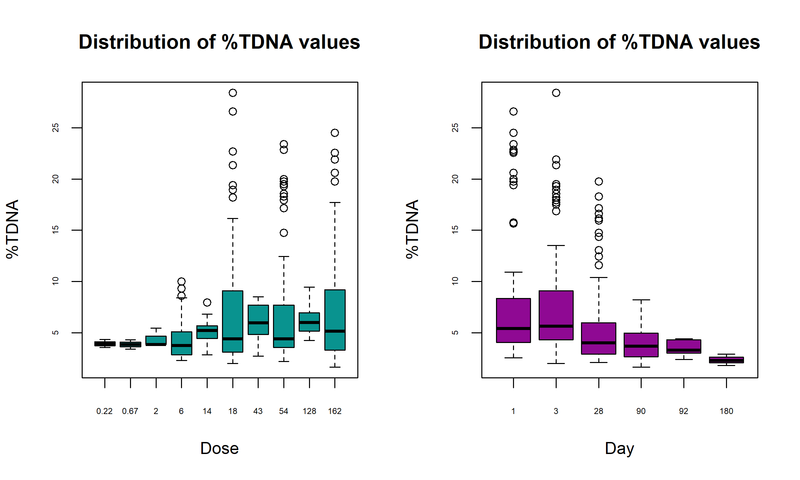
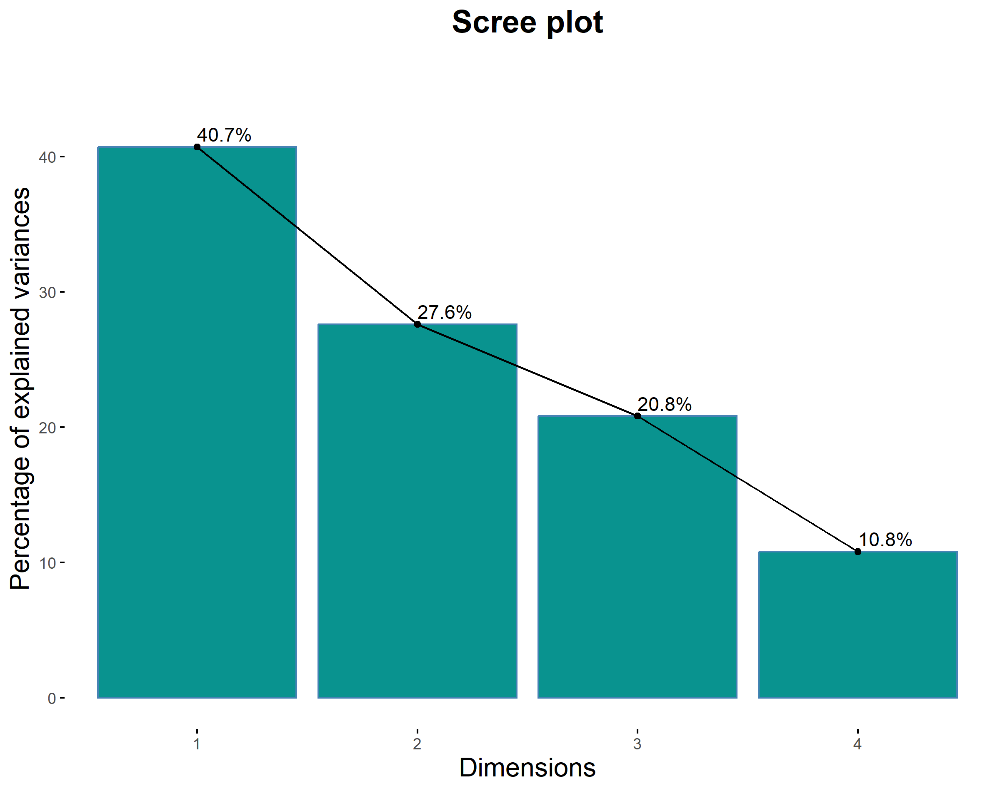
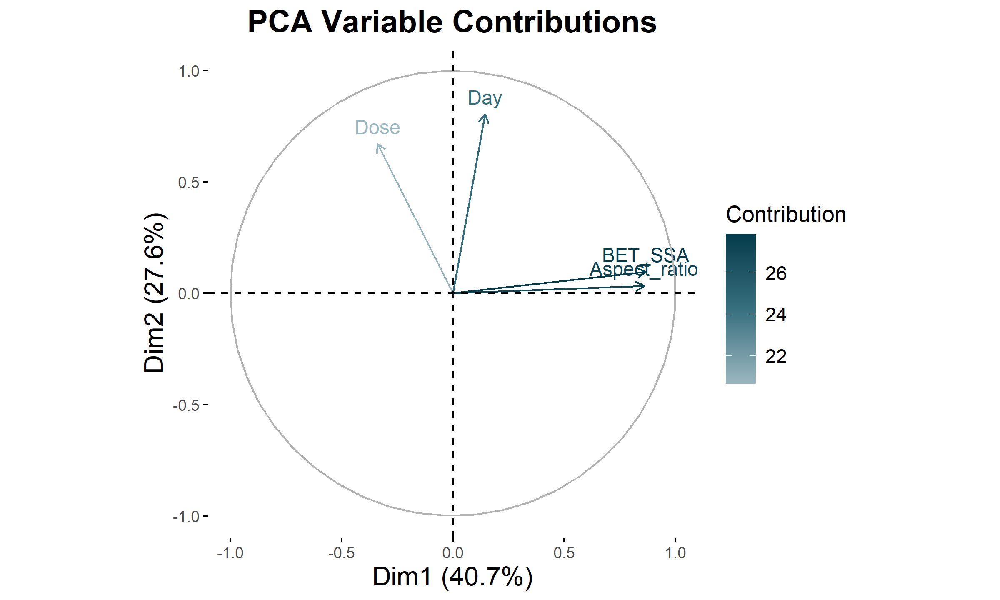
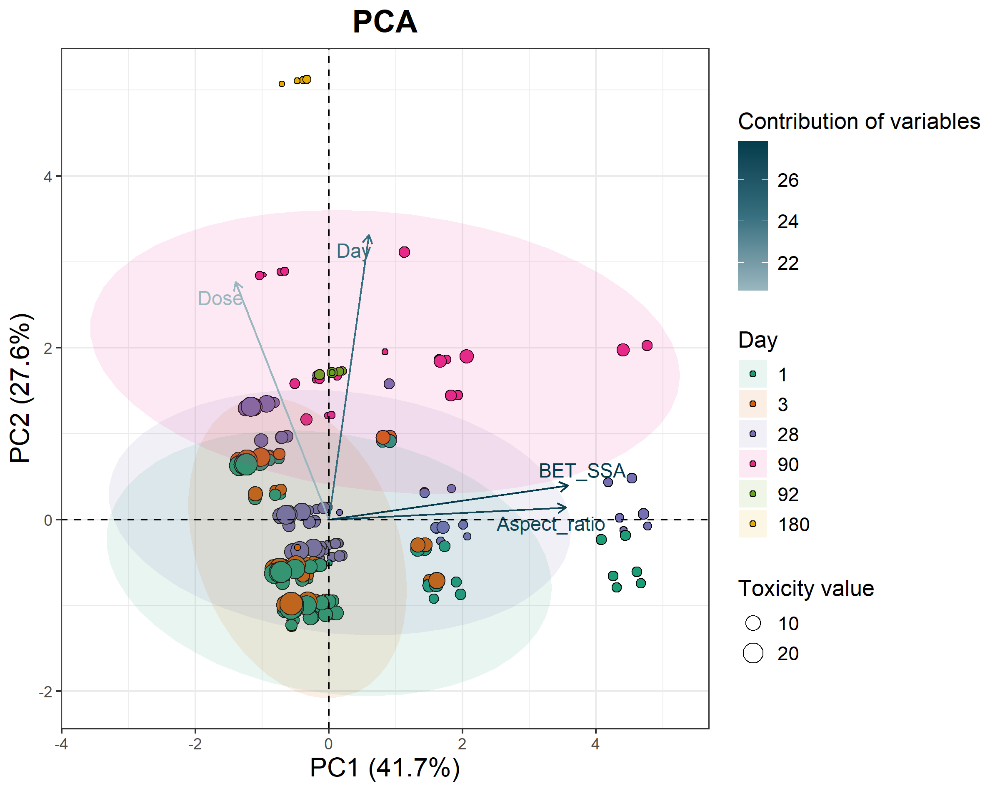

```{r setup, include=FALSE}
knitr::opts_chunk$set(echo = TRUE, 
                      message = FALSE, 
                      cache = FALSE,
                      warning = FALSE,
                      fig.align = 'center',
                      dpi = 300)
```


```{r packages, echo=FALSE}
# Installing and loading  packages
packages <- function(x){
  not_installed <- x[!x %in% installed.packages()[, "Package"]]
  if(length(not_installed) > 0) 
    install.packages(not_installed, dependencies = TRUE)
  invisible(lapply(x, require, character.only = TRUE))
}

packages(c("magrittr", "dplyr", "tidyverse", "GGally", "ggpubr", "corrplot", "FactoMineR", "factoextra"))
```


```{r data import}
# Setting the working directory to the folder containing the currently open file in RStudio
setwd(dirname(rstudioapi::getActiveDocumentContext()$path))

# Loading data
data <- read.csv2("input_file.csv", header = TRUE, dec = ",")
```


```{r splitting, autoscaling}
# Data sorting
SortedData <- data[order(data[, ncol(data)]), ]

# The most extreme values should be included in the training set. The number of rows with the lowest and highest values to be included in the training set: 
nexv = 3

ExRows <- rbind(SortedData[1:nexv, ], SortedData[(nrow(SortedData)-nexv+1):nrow(SortedData), ])
DataSplit <- SortedData[-c(1:nexv, (nrow(SortedData)-nexv+1):nrow(SortedData)), ]

# Training and validation sets 
ValidationSet <- data.frame()  
TrainingSet <- data.frame()       

for (i in seq_len(nrow(DataSplit))) {
  # The data split ratio is 2:1, where every third element is placed in the validation set
  if (i %% 3 == 1) {
    ValidationSet <- rbind(ValidationSet, DataSplit[i, ])
  } else {
    TrainingSet <- rbind(TrainingSet, DataSplit[i, ])
  }
}

TrainingSet <- rbind(ExRows, TrainingSet)

TrainingSet$Set <- 'T'
ValidationSet$Set <- 'V'

# Responces vectors
RespTrain <- as.vector(TrainingSet[, ncol(TrainingSet) - 1])
RespVal <- as.vector(ValidationSet[, ncol(ValidationSet) - 1])

# Matrix with descriptors
DescT <- as.matrix(TrainingSet[, 2:(ncol(TrainingSet) - 2)])
DescV <- as.matrix(ValidationSet[, 2:(ncol(ValidationSet) - 2)])

# Name of columns
ChemNameT <- TrainingSet[,1]
ChemNameV <- ValidationSet[,1]

# Autoscaling data
scaling <- function(x, sc_data){
  average <- mean(sc_data)
  stdev <- sd(sc_data)
  if (stdev == 0) {
    return(rep(0, length(x)))  
  }
  autoscaled_x <- (x-average)/stdev
  autoscaled_x
}

AutoscDescT <- as.data.frame(matrix(NA, nrow = nrow(DescT), ncol = ncol(DescT)))
AutoscDescV <- as.data.frame(matrix(NA, nrow = nrow(DescV), ncol = ncol(DescV)))


for (i in 1:ncol(DescT)) {
  AutoscDescT[, i] <- scaling(DescT[, i], DescT[, i])
}

for (i in 1:ncol(DescV)) {
  AutoscDescV[, i] <- scaling(DescV[, i], DescT[, i])
}

DescNames <- colnames(DescT)
AutoscDescNames <- paste0("Autoscaled_", DescNames) 

# Summary table
Summary <- data.frame(rbind(
  setNames(cbind(ChemNameT, DescT, AutoscDescT, RespTrain, TrainingSet$Set), 
           c("ChemName", DescNames, AutoscDescNames, "Experimental", "Set")), 
  setNames(cbind(ChemNameV, DescV, AutoscDescV, RespVal, ValidationSet$Set), 
           c("ChemName", DescNames, AutoscDescNames, "Experimental", "Set"))))

rownames(Summary) <- NULL

print(Summary)

```

```{r heatmap for independent variables, fig.width=6, fig.height=6, fig.path='figures/'}
# Save Heatmap to PNG
png("docs/figures/HeatMap.png", width = 6, height = 6, units = "in", res = 600)

# Computing the correlation matrix
CorrelationMatrix <- cor(data[, 2:(ncol(data) - 1)], use = "complete.obs")

# Color palette for the plot
col <- colorRampPalette(c("#6e7222","#b8bf3a", "#c6cb61", "#dbdf9c", "#b3b0e5", "#5c57ac", "#2e2988", "#292479"))

# Heatmap
corrplot(CorrelationMatrix, 
          method = "color", 
          col = col(100), 
          tl.col = "black", 
          tl.srt = 45, 
          addCoef.col = "black", 
          number.cex=0.7)

invisible(dev.off())
```
### Heatmap

The heatmap plot displays the correlation levels between the independent variables. Correlation coefficients are determined using Pearson's test.


```{r boxplot for dependent variables, fig.width=10, fig.height=6}
#Save Boxplot to PNG
png("docs/figures/Boxplot.png", width = 10, height = 6, units = "in", res = 600)

# Arranging two plots horizontally in a single graphic
par(mfrow = c(1,2))

# Boxplots
boxplot(TDNA~ Dose, 
        data = data,
        col = "#09938F", 
        xlab = "Dose", 
        ylab = "%TDNA", 
        main = "Distribution of %TDNA values",
        cex.axis = 0.7, 
        cex.lab = 1,    
        cex.main = 1.2)
boxplot(TDNA~ Day, 
        data = data,
        col = "#8f0993", 
        xlab = "Day", 
        ylab = "%TDNA", 
        main = "Distribution of %TDNA values",
        cex.axis = 0.7, 
        cex.lab = 1,    
        cex.main = 1.2)

invisible(dev.off())
```

### Boxplots

The distribution of the dependent variable is shown across different doses and exposure durations to the nanomaterial. The boxplot highlights the toxicity values, with the median indicated by the thick line within the box. The box boundaries represent the first and third quartiles of the data, while the "whiskers" extend to 1.5 times the interquartile range (IQR) beyond the quartiles. Points beyond this range are identified as outliers.



```{r PCA}
# Selecting data for PCA
DataPCA <- data[, -c(1, ncol(data))]
# PCA
ResultsPCA <-  PCA(DataPCA, scale.unit = TRUE, ncp = 5, graph = FALSE)

EigenValues <- ResultsPCA$eig 

print(EigenValues)

# Setting the maximum value on the Y-axis
MaxYEV <- max(EigenValues[, "percentage of variance"]) + 5 
# Save Scree plot to PNG
png("docs/figures/EigenValues.png", width = 10, height = 6, units = "in", res = 600)
# Scree plot
fviz_eig(ResultsPCA, 
         addlabels = TRUE, 
         main = "Scree plot",
         col = "#09938F",              
         barfill = "#09938F",   
         border = "black",
         ylim = c(0, MaxYEV)) +
  theme(
    panel.grid.major.x = element_blank(), 
    panel.grid.minor.y = element_blank(),
    panel.grid.major.y = element_blank(), 
    panel.grid.minor.x = element_blank(),
    panel.background = element_rect(fill = "white", color = NA), 
    plot.title = element_text(hjust = 0.5, size = 18, face = "bold"),
    axis.title = element_text(size = 15))
invisible(dev.off())

# Save Contributions plot to PNG
png("docs/figures/Correlation_circle.png", width = 10, height = 6, units = "in", res = 600)
# Contributions plot
fviz_pca_var(ResultsPCA, 
             col.var = "contrib",
             gradient.cols = c("#9ab7bf", "#366f7f", "#033c4c")) +
  ggtitle("PCA Variable Contributions") +
  theme(
    panel.grid.major.x = element_blank(), 
    panel.grid.minor.y = element_blank(),
    panel.grid.major.y = element_blank(),
    panel.grid.minor.x = element_blank(),
    panel.background = element_rect(fill = "white", color = NA), 
    plot.title = element_text(hjust = 0.5, size = 18, face = "bold"),
    axis.title = element_text(size = 15),
    legend.title = element_text(size = 13),
    legend.text = element_text(size = 11)) +
  labs(color = "Contribution") 
invisible(dev.off())

# Save Biplot to PNG
png("docs/figures/Biplot.png", width = 10, height = 8, units = "in", res = 600)
TDNA_PCA <- as.numeric(data$TDNA)
Day_PCA <- as.factor(data$Day)
# Biplot
fviz_pca_biplot(ResultsPCA, 
                # Endpoits
                geom.ind = "point",
                fill.ind = Day_PCA, # color the points based on the day number
                col.ind = "black",
                pointshape = 21, 
                pointsize = TDNA_PCA, # point size depends on toxicity value
                palette = "Dark2",
                repel = TRUE,
                addEllipses = TRUE,
                # Variables 
                col.var = "contrib",
                gradient.cols = c("#9ab7bf", "#366f7f", "#033c4c"),
                
                legend.title = list(fill = "Day", color = "Contribution of variables", size = "Toxicity value")) + 
  labs(title = "PCA", x = "PC1 (41.7%)", y = "PC2 (27.6%)") + 
  theme_bw() + 
  theme(
    plot.title = element_text(hjust = 0.5, size = 18, face = "bold"),
    axis.title = element_text(size = 15),
    legend.title = element_text(size = 13),
    legend.text = element_text(size = 11)) 
invisible(dev.off())
```

### Scree plot

The Scree plot displays the eigenvalues for each principal component in PCA, indicating how much variance in the data is explained by each component. The plot helps identify which components have the most significant impact on the data, allowing for the selection of the number of components for further analysis.



### PCA Variable Contributions

The correlation between a variable and a principal component (PC) is used as the coordinates of the variable on the PC. The contribution represents the proportion of a variable's contribution to a given principal component, expressed as a percentage. 
* Positively correlated variables are grouped together.
* Negatively correlated variables are positioned on opposite sides of the plot origin (opposed quadrants).
Variables that are correlated with PC1 and PC2 are the most important in explaining the variability in the data set.

Information adapted from the detailed study of Principal Component Analysis available at: https://f0nzie.github.io/machine_learning_compilation/detailed-study-of-principal-component-analysis.html


* Dose: A weak negative contribution to PC1 and a moderate positive contribution to PC2.
* Day: A weak positive contribution to PC1 and a large positive contribution to PC2.
* Aspect ratio: A large positive contribution to PC1 and a weak positive contribution to PC2.
* BET_SSA: A large positive contribution to PC1 and a weak positive contribution to PC2.
* Aspect ratio and BET_SSA are strongly correlated with each other.


### PCA Biplot 

A biplot simultaneously presents the distribution of observations and the contribution of variables. Four key pieces of information can be extracted from it:

1. Distribution of observations: The distance between points indicates the similarity between observations—observations that are closer together are more similar with respect to the variables.

2. Contribution of variables: The direction of the vectors indicates the direction in which the variables have the greatest influence on the principal components, while the length of the vector reflects the strength of this influence. The longer the vector, the stronger the contribution of the variable to the respective component.

3. Relationships between variables: Variables represented by vectors in the same direction are positively correlated, whereas those in opposite directions exhibit negative correlation. Variables that are orthogonal to each other are independent (uncorrelated).

4. Interactions between observations and variables: It is also possible to observe how individual variables influence the positioning of observations in the principal component space. Observations that are close to a given variable’s vector have a high value for that variable.



